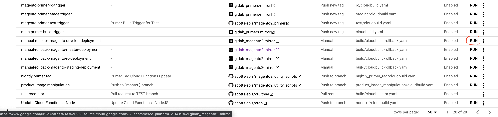

<h2>Welcome</h2>
Welcome to the Scotts Magento 2 eCommerce Project! We're glad you'd like to learn more about contributing to this codebase.

## Communication and Access
We use the following platforms for communication on this project. Please make sure you have access to them all. 
1. JIRA - The ECOM project tracks tickets and development requirements
2. Confluence - Contains deep wiki information and documentation for developers
3. Slack - Day to Day Communication for the project #magento2project
4. Google Cloud - Cloud Infrastructure Access
5. Github - This Repo is at https://github.com/scotts-ebiz/cruithne

### Wiki Documentation 
Most of the documentation can be found at the [Magento 2](https://scotts.jira.com/wiki/spaces/DTCWiki/pages/541327393/Magento+2) Confluence Page

## Installation/Local Development
Use the guide below to setup your local environment
[M2 - Setup Local Environment](https://scotts.jira.com/wiki/spaces/DTCWiki/pages/541261927/M2+-+Setup+Local+Environment)

## Contributing to this codebase
Currently our daily development branch is the `test` branch. You'll see the most regular changes in this branch and should use it to start your development. 

### Some basic rules
1. Do NOT modify the `vendor` files directory. We are not in the business in modifying the Magento code directly. Magento can be buggy if we absolutely cannot fix the problem with our own module. Do NOT put our code in the vendor directory. We will sometimes have to patch Magento code, but that is done outside of the `vendor` directory.
1. All SMG code must be in the following directory `app/code/SMG`. 
1. Try to install external modules with composer whenever possible. If you cannot find a module that works with our current Magento version, then do some effort to re-evalute how necessary that module is. If we absolutely need that 3rd party module (ex. _Vantiv_), then we install it in the `app/code/<insert vendor name>` directory
1. A Branch and therefore PR should be distinct and should _not_ rely on any other branch. Please build your code modularly. We like small PRs, but we like independent PRs more.

### Creating a Module
1. We use semantic versioning for module versioning. Most often we just update the right most number whenever there is an update to the module
1. When creating a module, make sure all your information is in the `UpgradeSchema.php` or `UpgradeData.php`. `InstallSchema.php` and `InstallData.php` only run when the module is first installed. We run a `setup:upgrade` on each deploy to pull the latest changes to modules. 
1. If you're creating a Widget Module, make sure to add the word "Widget" to the end so that we know it's a Widget. Most of the time we're creating Modules because they're more generic
1. Frontend work should be in the `frontend` module directory, Admin/Backend work should be in the `view/adminhtml` module directory. 
1. Please start all Class variables with `$_`.
1. Escape all outputs in HTML (to combat Cross-Site Scripting Attacks)

### Start with a JIRA ticket
When possible start with an assigned JIRA ticket at [scotts.jira.com](https://scotts.jira.com/secure/RapidBoard.jspa?rapidView=89&projectKey=ECOM). Move your ticket from the *ToDo* status to *InProgress*. 

### Create a branch from test
You may start development by pulling the latest version of the `test` branch and creating a new branch from this. 
Please name your new branch so that it starts with the Ticket Number/ID. Example `ECOM-523-Changing-a-thing`. What you put after the ID is up to you, but please make sure it's descriptive enough for us to know what this branch entails. 

### Checkout your new branch
Checkout your branch and start work. Make as many changes and commits as necessary. We're not strict on commit messages, but please make them descriptive enough to descibre what the new change you made was. 

### Push to github
Once you've got your code completed, push the changes to the origin, which should be "git@github.com:scotts-ebiz/cruithne.git"

### Create the Pull Request
Browse to your branch in github and create a new pull request. Please make sure that your are pulling your code into the `test` branch. 

The Pull Request is an important time to communicate to the other developers what you are trying to achieve with your new code change. Please make sure the PR is descriptive and include a link to the original JIRA issue. 
Please also make sure any manual testing steps are included. 

Also. Make sure to include the following groups in the "Reviewers" section. Pro-Tip - it autofills, so you can just start typing `magento` and you should see the groups quickly.
* scotts-ebiz/magento2-scotts-contractors 
* scotts-ebiz/magento2-scotts-developers

Once you're ready, create the PR

### Respond to any requests
At this point other developers will review your code, please respond accordingly. 

We also have TravisCI creating an adhoc sample build of Magento every time a new PR is created. Monitor this check to make sure it passes. If it fails, we may not be able to send it through. 

Lastly, look out for conflicts. Not just at PR creation time, but as new PRs go in. Sometimes code affects each other and you may be responsible to update any conficts that arrise.

## Manual rollback in case of non-working deployment

If for some reason the code you pushed does not work after deployment, you can rollback to the previous version. To do this, follow the GCP console -> CloudBuild and manually start the manual rollback job of the required environment.

